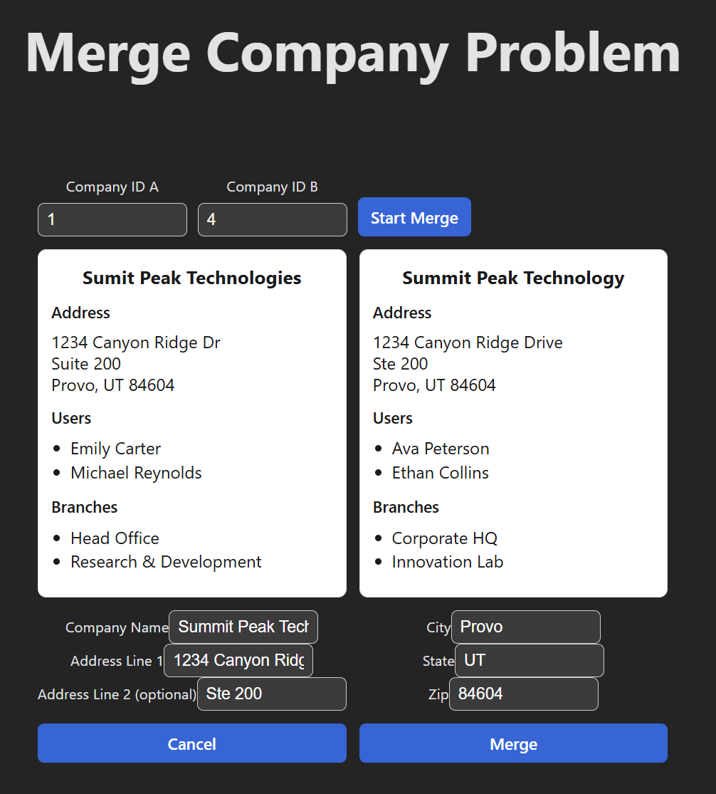
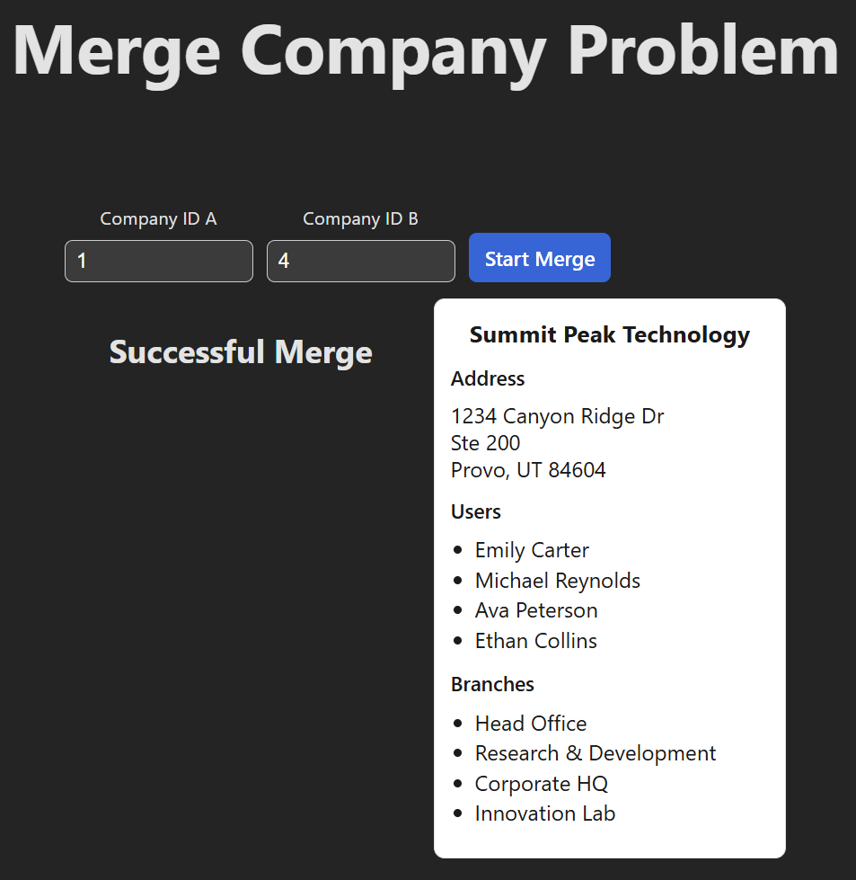

# merge-company-problem

## Description of the Scenario
The scenario is you have two companies in a database (one is a duplicated of the other, entered erroneously by an
employee).

Provide an HTTP interface to merge these two companies together. Include in your solution a way for users to resolve
conflicts when data points differ between the two companies. Ensure your solution also handles the updating of Users
and Branches so that they are associated with the correct, resulting company from the merge.

Suppose that a few months down the road, a different team member needs to add a Credit Limit (an integer) to the
company entity. How might you architect your solution so that your code will be maintained?

## Time Log

| Hours | Work Done                                                                                                                             |
|-------|---------------------------------------------------------------------------------------------------------------------------------------|
| 0-2   | Set up backend infrastructure, including fastify route handler, and da methods. Generate dummy data. Write tests for da functionality |
| 2-3   | Set up route handler and business logic for the two necessary endpoints: `GET /company/:id` and `PUT /company/merge`                  |
| 3-4   | Set up frontend infrastructure, shared type package, and api client for the frontend                                                  |

## Architectural Decisions
- Use Fastify for the backend framework
  - Fastify is a node framework that I've had a lot of experience during my time at BYU OIT. It's pretty easy to use
and has some useful functionality to integrate with TypeBox for request validation.
- Use Maps for In-Memory Storage
  - Since the problem was focused on business logic, I decided to use in-memory storage for the sake of simplicity. This
also allowed me to use that storage for unit testing my da methods.
- Use Node:Test for testing
  - Node:test comes out of the box with Node.js and is great for a simple unit test suite. I added the unit tests to 
ensure that my da methods were working correctly.
- Use TypeBox for type checking and validation
  - TypeBox integrates nicely with Fastify and is a great way to validate incoming requests. That way, I don't have to
write any custom logic to validate the shape of incoming requests. I can just create a TypeBox schema and use that to
validate incoming requests.
- Use React for the frontend framework
  - It is very easy to set up a React app by using Vite. Vite will create the whole project for you, which is very nice
for me since this problem isn't focused on frontend design. I just wanted to get something up and running quickly.

## Backend Merging Logic
The approach I took was to let the frontend handle the actual conflicts in company data (more on that later), and let
the backend handle the actual merging of the two companies. 

The `PUT /company/merge` endpoint expects two company IDs as query parameters. These are the ids of the companies that
will be merged. The first id will be kept and the second id will be deleted. The endpoint expects the body to contain
the company data that will represent the "new" merged company.

The route handler first updates the company data for the first company id to match the data in the body. Then, it updates
all users and branches associated with the second company id so that they are connected to the first company id. This 
ensures that no users or branches are orphaned after deleting the second company. The second company is then deleted and,
if all goes well, the handler returns a 200 response with all the associated data for the merged company. 

## Frontend Conflict Resolution Logic
As I stated earlier, the frontend is responsible for handling the conflicts between the two companies that you want to
merge. The way I handled this was by allowing the user to submit two ids for the companies they want to merge. 

Then the frontend would display the data for each company after making the necessary API calls to get the data. The user 
is then expected to fill out the necessary fields for the company to be merged. 

When the user fills out all the fields and clicks the merge button, the frontend will make a PUT request to the backend 
to merge the two companies. The frontend will then display the new, merged company data.
